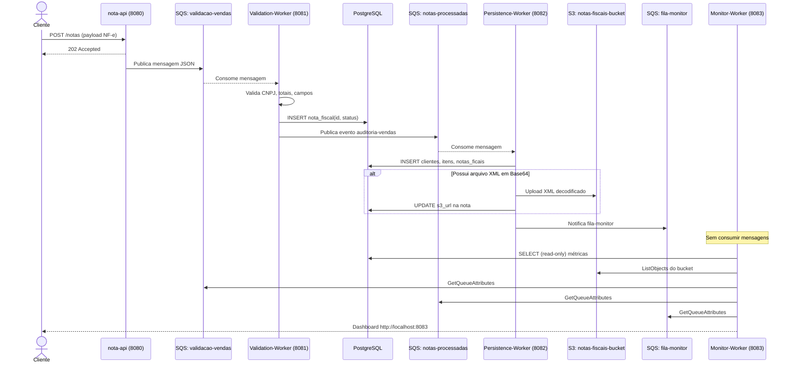

# AsyncFlow — Plataforma de Processamento Assíncrono de Notas Fiscais

<div align="center">


**Projeto pessoal demonstrando arquitetura orientada a eventos com microsserviços desacoplados, mensageria assíncrona e boas práticas de engenharia de software.**

</div>

---

## 💡 Sobre o Projeto

O **AsyncFlow** simula um pipeline real de processamento de **Notas Fiscais eletrônicas (NF-e)** como é encontrado em empresas de e-commerce, distribuidoras e ERPs. O sistema foi desenhado para demonstrar domínio sobre os seguintes conceitos que são altamente valorizados no mercado:

- **Arquitetura orientada a eventos** — os serviços não se chamam diretamente; eles publicam e consomem mensagens de filas SQS.
- **Princípios SOLID e Clean Architecture** — cada módulo respeita os limites de sua responsabilidade e depende de abstrações (ports & adapters / hexagonal).
- **Padrões de resiliência distribuída** — tratamento de falhas com `try/catch` semântico, status de erro no banco e design que suporta Dead Letter Queues (DLQs).
- **Separação de contextos (Bounded Contexts)** — cada microsserviço persiste apenas o que pertence ao seu contexto de domínio.
- **Observabilidade** — painel de controle centralizado que agrega métricas de filas, banco e S3 sem interferir no fluxo de produção.

---

## 🏗️ Arquitetura — Visão Geral


> **Leitura do diagrama:** Uma Nota Fiscal entra pela `nota-api` (REST), é enfileirada no SQS, validada pelo `Validation-Worker`, persistida pelo `Persistence-Worker` (banco + S3) e monitorada em tempo real pelo `Monitor-Worker`. Os serviços nunca se chamam diretamente — toda coordenação passa pelas filas.

---

## 🔬 Pensamento Arquitetural — Por que foi feito assim?

### ❌ O problema de sistemas síncronos acoplados

Em sistemas REST tradicionais, um serviço que valida, persiste e envia e-mail de confirmação de uma NF-e faz tudo em sequência, na mesma thread. Basta um desses passos travar (banco lento, S3 fora, e-mail falhou) para a requisição do cliente falhar e a NF-e ser perdida.

### ✅ A solução adotada: Event-Driven com SQS

No AsyncFlow, a API recebe a NF-e, **confirma o recebimento imediatamente** e enfileira o payload no SQS. A partir daí, cada worker processa de forma independente, com possibilidade de retry e tratamento de mensagens com falha por meio das políticas do SQS, sem que o cliente ou o serviço de entrada precise esperar ou saber o que aconteceu depois.

```
Benefícios diretos:
  ✔ Resiliência e desacoplamento — a indisponibilidade temporária de um worker
    não impede o recebimento das mensagens pela API; o SQS retém as mensagens
    até o serviço voltar a consumir normalmente
  ✔ Escalabilidade horizontal — basta subir mais instâncias do worker gargalo
  ✔ Auditabilidade — cada etapa gera um rastro mensurável no SQS e no banco
  ✔ Desacoplamento real — serviços ignoram a existência uns dos outros
```

---

## 📦 Microsserviços — Responsabilidade e Justificativa

O projeto é um **monorepo Maven** composto por 5 módulos:

```
AsyncFlowApplication/
├── services/
│   ├── shared/               ← contratos compartilhados (enum NotaFiscalStatus)
│   ├── nota-api/             ← API REST de entrada (porta 8080)
│   ├── Validation-Worker/    ← motor de validação de regras (porta 8081)
│   ├── Persistence-worker/   ← persistência de dados + upload S3 (porta 8082)
│   └── monitor-worker/       ← dashboard de observabilidade (porta 8083)
├── test-scripts/             ← scripts Python e Java para simular mensagens
├── docker-compose.yml        ← LocalStack (SQS + S3) + PostgreSQL
└── pom.xml                   ← parent POM do monorepo
```

---

### 1️⃣ `nota-api` — Gateway de Entrada (Porta 8080)

**O que faz:**
Expõe endpoints REST para recebimento de Notas Fiscais, autenticação de usuários e cadastro de clientes. Ao receber uma NF-e, converte o payload para JSON e **publica de forma assíncrona** na fila SQS `validacao-vendas`.

**Por que faz assim:**
A API não valida, não persiste e não sabe o que acontece depois. Ela é exclusivamente um **ponto de entrada desacoplado**. Isso significa que uma manutenção no `Validation-Worker` não exige downtime da API — o SQS acumula as mensagens até o worker voltar.

**Tecnologias relevantes:** Spring Web, Spring Cloud AWS SQS, Spring Security, Lombok.

---

### 2️⃣ `Validation-Worker` — Motor de Validação (Porta 8081)

**O que faz:**
Consome mensagens da fila `validacao-vendas` e executa as seguintes validações:
- ✅ Valida o **CNPJ do emitente** (dígitos verificadores).
- ✅ Valida a **soma total dos itens** contra o valor declarado na nota.
- ✅ Verifica **campos obrigatórios** (cliente, itens, datas, número da nota).

Após a validação, **persiste o resultado no banco** e **publica um evento** na fila `auditoria-vendas`.

**Por que persiste apenas `id + status`?**
> Este é um ponto arquitetural crítico deliberado.

O contexto deste worker é estritamente **operacional**: ele precisa responder *"esta nota passou na triagem?"*, não *"qual o histórico completo desta venda?"*. Gravar apenas `(numeroNota, status)` na tabela `nota_fiscal` é suficiente para sua responsabilidade. Isso traz três vantagens:

| Vantagem | Explicação |
|---|---|
| **Responsabilidade restrita** | Reduz a quantidade de dados persistidos nesse contexto e mantém a responsabilidade do worker limitada à validação — sem acoplamento ao modelo de negócio de vendas. |
| **Baixo bloqueio** | Menos contenção no banco. Escritas leves e bem indexadas reduzem a disputa por locks entre instâncias concorrentes do worker. |
| **LGPD / Privacy by Design** | Dados pessoais do comprador (CPF, nome) não ficam expostos em tabelas de auditoria técnica — eles só existem na camada de negócio do `Persistence-Worker`. |

**Tecnologias relevantes:** Spring Cloud AWS SQS Listener (`@SqsListener`), Spring JPA, `@EnableAsync`, Lombok.

---

### 3️⃣ `Persistence-Worker` — Persistência Completa + Arquivamento S3 (Porta 8082)

**O que faz:**
Consome mensagens da fila `notas-processadas` (notas já validadas pelo worker anterior) e executa a **persistência completa de dados de negócio**:

1. Salva o **cliente** na tabela `clientes`.
2. Salva os **itens** da nota na tabela `itens`.
3. Salva o **cabeçalho completo** da nota em `notas_ficais` (CNPJ, status, s3_url).
4. Se o payload contiver um arquivo XML em **Base64**, realiza a decodificação e **upload para o bucket S3** `notas-fiscais-bucket`.
5. Atualiza o campo `s3_url` no banco com o endereço do arquivo armazenado.
6. Notifica a fila `fila-monitor` indicando que o processamento finalizou.

**Por que persiste os dados completos aqui?**
Este worker é o **dono do contexto de negócio de vendas**. Ele é a fonte de verdade para histórico de faturamento e auditoria contábil. Ao persistir aqui — e não no `Validation-Worker` — garantimos a Separação de Contextos Delimitados (Bounded Contexts), onde cada serviço governa apenas seus próprios dados.

**Por que S3 para o XML e não no banco?**
Arquivos XML de NF-e podem ter vários kilobytes. Armazená-los como `BYTEA` no PostgreSQL é um anti-padrão que tende a degradar a performance de leitura das tabelas relacionais. O S3 é uma alternativa adequada para armazenamento de arquivos e objetos não estruturados, enquanto o PostgreSQL mantém os metadados e a referência ao arquivo (`s3_url`).

**Tecnologias relevantes:** Spring Cloud AWS SQS (`@SqsListener`), AWS SDK v2 (S3), Spring JPA, `@Async`, Lombok.

---

### 4️⃣ `monitor-worker` — Painel de Observabilidade (Porta 8083)

**O que faz:**
Serve um **dashboard administrativo** e uma API REST para monitoramento em tempo real do sistema. Exibe:
- Contagem de mensagens em cada fila SQS (`visíveis`, `em processamento`, `atrasadas`).
- Notas fiscais agrupadas por status (`VALIDADA`, `INVALIDA`, `ERRO`).
- Lista de arquivos XML no bucket S3.
- Listagem de clientes e itens persistidos.

**Por que é um serviço separado e não um endpoint na `nota-api`?**
O princípio da **Separação de Responsabilidades (SRP)** se aplica aqui. Monitoramento é uma preocupação transversal (*cross-cutting concern*). Ao isolá-lo em um serviço dedicado:
- Ele pode ser escalado ou derrubado sem afetar o fluxo de produção.
- Ele **não remove mensagens das filas** — apenas consulta métricas via `GetQueueAttributes`.
- O acesso ao banco é **somente-leitura** (`ddl-auto=none`, `show-sql=false`).

**Tecnologias relevantes:** Spring MVC, Thymeleaf (dashboard HTML), SpringDoc / Swagger OpenAPI 3, AWS SDK v2 (SQS + S3).

---

### 5️⃣ `shared` — Contratos Compartilhados

Módulo Maven simples que contém o enum `NotaFiscalStatus` (`PROCESSANDO`, `VALIDADA`, `INVALIDA`, `ERRO`). Todos os outros módulos dependem dele, garantindo **consistência de vocabulário** entre serviços sem duplicação de código.

---

## 📐 Fluxo Completo Passo a Passo



---

## ⚠️ Cuidados Arquiteturais e Resiliência

### At-Least-Once Delivery e Idempotência
O SQS garante entrega de mensagens **pelo menos uma vez**. Em cenários de falha de rede, a mesma nota pode ser entregue mais de uma vez ao worker. O fluxo utiliza `numeroNota` como identificador único para evitar a criação de registros duplicados. O tratamento de reentregas e efeitos parciais — como cliente já inserido mas itens ainda não — é uma preocupação arquitetural considerada no desenho do processamento e que exigiria transações distribuídas ou mecanismos de compensação em um ambiente de produção completo.

### Dead Letter Queues (DLQ) — próximo passo
Em produção, cada fila principal deve ter uma **DLQ associada**. Se uma mensagem falhar `N` vezes (configurável pelo `maxReceiveCount`), ela é movida para a DLQ para inspeção manual, sem bloquear o processamento das mensagens seguintes (*poison messages*).

### Dual Write Problem (S3 + PostgreSQL)
O `Persistence-Worker` realiza escritas em duas mídias distintas (S3 e banco). O código trata falhas de forma explícita: se o upload para o S3 falhar, o status da nota é marcado como `ERRO` no banco e a mensagem pode ser reprocessada pela política de retry do SQS.

### Visibility Timeout
O tempo de visibilidade das filas deve ser maior do que o tempo máximo esperado para o pior caso de processamento (ex: upload de um XML pesado em conexão lenta). Caso contrário, a mensagem volta a ficar visível e dois workers processam a mesma nota em paralelo.

---

## 🛠️ Stack Tecnológica

| Tecnologia | Versão | Uso |
|---|---|---|
| Java | 21 | Linguagem principal |
| Spring Boot | 3.2.5 | Framework de aplicação |
| Spring Cloud AWS | 3.x | Integração SQS / S3 |
| AWS SDK v2 | 2.x | Clientes AWS nativos |
| LocalStack | 3.4.0 | Simulação local de AWS |
| PostgreSQL | 16 | Banco de dados relacional |
| Docker Compose | — | Orquestração local da infraestrutura |
| Thymeleaf | 3.x | Template engine do dashboard |
| SpringDoc OpenAPI | 2.x | Documentação Swagger |
| Lombok | — | Redução de boilerplate |

---

## 🚀 Como Executar Localmente

### Pré-requisitos
- Java 21+, Maven 3.8+, Docker Desktop

### 1. Subir a infraestrutura
```bash
docker-compose up -d
```
> Inicia o PostgreSQL (`:5432`) e o LocalStack com SQS + S3 (`:4566`).

### 2. Compilar o monorepo
```bash
mvn clean install
```

### 3. Iniciar os serviços (em terminais separados)
```bash
# Terminal 1
cd services/nota-api && mvn spring-boot:run

# Terminal 2
cd services/Validation-Worker && mvn spring-boot:run

# Terminal 3
cd services/Persistence-worker && mvn spring-boot:run

# Terminal 4
cd services/monitor-worker && mvn spring-boot:run
```

---

## 🧪 Testando o Pipeline

### Opção A — Python (recomendado para início rápido)
```bash
pip install boto3
cd test-scripts
python send-test-messages.py
```

### Opção B — Java
```bash
cd test-scripts/send-test-messages
mvn package -q
java -jar target/send-test-messages-1.0.0.jar
```

O script envia notas de teste diretamente nas filas SQS e imprime o resultado no console.

---

## 📊 Observabilidade

| Interface | URL | Descrição |
|---|---|---|
| **Dashboard Web** | `http://localhost:8083` | Painel visual com métricas em tempo real |
| **Swagger nota-api** | `http://localhost:8080/swagger-ui.html` | Documentação da API de entrada |
| **Swagger monitor** | `http://localhost:8083/swagger-ui.html` | Endpoints REST do monitor |
| **API JSON** | `http://localhost:8083/api/monitor/dashboard` | Dados brutos do dashboard |

### Validando no PostgreSQL
```sql
-- Tabela do Validation-Worker: apenas id + status
SELECT * FROM nota_fiscal;

-- Tabelas do Persistence-Worker: dados completos de negócio
SELECT numero_nota, status, s3_url, cnpj_emitente FROM notas_ficais;
SELECT * FROM clientes;
SELECT * FROM itens;
```

### Verificando uploads no S3 (LocalStack)
```bash
aws --endpoint-url=http://localhost:4566 s3 ls s3://notas-fiscais-bucket/
```

---

## 👨‍💻 Autor

Projeto desenvolvido como demonstração de arquitetura para o portfólio técnico.

[](https://github.com/DevHerbertt)

---

> *"A capacidade de um sistema de falhar graciosamente é tão importante quanto sua capacidade de funcionar corretamente."*
